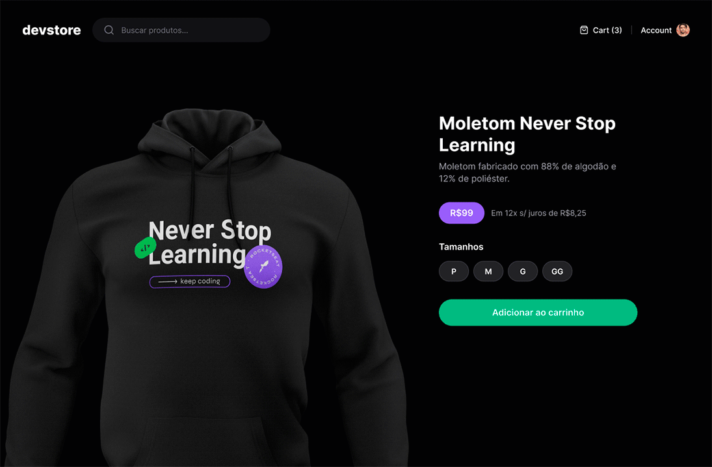

<h1 align="center">Next.js App Router e Testes - Devstore</h1>

  
  
  
  
  
  

 

  

 

## 💻 Projeto

Projeto de uma loja simples, focado em aprofundar conhecimentos em Next.js, especialmente no App Router e no desenvolvimento de testes E2E. Desenvolvido no curso "Next.js App Router e Testes" da Rocketseat.

## 🔖 Layout

Você pode visualizar o layout do projeto clicando [aqui](https://www.figma.com/community/file/1299037596397442545/devstore-projeto-react).